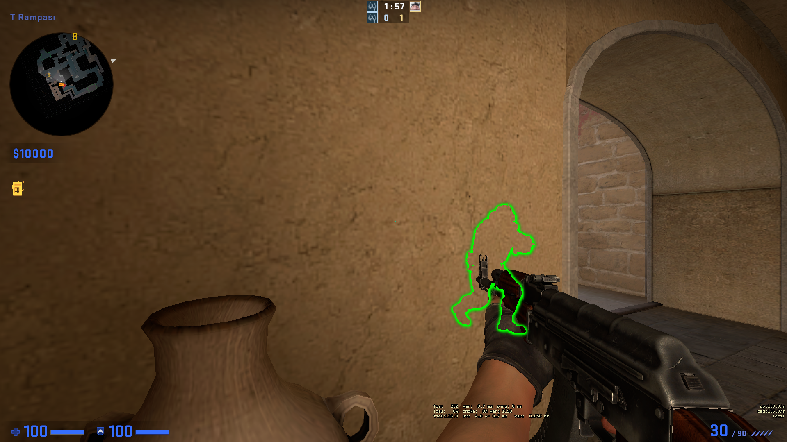
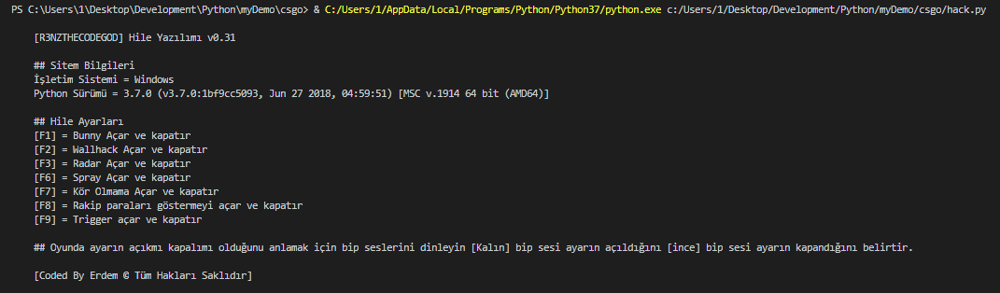

# R3nzTheCodeGOD CSGO Cheat
Legit sayılıcak özelliklere sahip csgo hilesidir. Komut isteminde çalışır. Hile açma kapama tuşları değiştirmek için `config.py` klasöründeki ayarları değiştirin.

|Hileler Türkçe|İngilizce|
|-|-|
|DuvardanGörüş|WallHack|
|OtoZıplama|BunnyHop|
|radar|radar|
|sekmeme|recoilControl|
|körOlmama|noFlash|
|rakiplerinParası|enemyMoney|
|OtomatikNişan|Aimbot|

# Yükleme Ve Çalıştırma
+ Offsetlerin güncel olup olmadığını kontrol edin [Güncel Offsetler](https://github.com/frk1/hazedumper/blob/master/csgo.hpp)
+ Hileyi indirin
+ Bilgisayarınızda eğer yoksa [Python]() kurun
+ `yükleyici.bat` adlı dosyayı çalıştırın bilgisayarınıza kütüphaneleri kursun
+ `başlat.bat` adlı dosyayı çalıştırıp **CSGO**'ya girin ve hileyi deneyin
+ Eğer `Başlat.bat` ile hileyi çalıştıramadıysanız **CMD(yani Komut İstemini)** yönetici olarak çalıştırın ve hile dosyasının olduğu dizinde `py hack.py` yazın

## Uyarı Ve Bilgilendirme
Hileyi kullanmaya başladığınızdan itibaren sorumluluk sizdedir, hile offsetler güncel olduğu sürece asla tespit edilemez tek ban riski overwatch'dur.

# Hileden Görüntüler
## WallHack

## Menü

  

